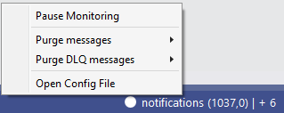

# Azure ServiceBus Monitor for Visual Studio

Adds a configurable status bar entry to show current runtime stats of monitored Azure ServiceBus entities (queues and subscriptions).
Currently retrieves and regularly updates the active and deadletter message counts.

Download the extension from the [Visual Studio Marketplace](https://marketplace.visualstudio.com/items?itemName=TimVinkemeier.vsservicebusmonitor).

--------------------------------------

## 1 Features

- Monitor Azure ServiceBus queues and topics
- Show active and deadletter message counts
- Fully configurable - monitor any number of entities and show only those that interest you
- Supports multiple profiles within one configuration
- Configurable to show entities only when a deadletter message is present
- Switch to alert background on any deadletters (can be turned off)

### 1.1 Status Bar indicator

The configured ServiceBus entities are shown in the status bar with their active and deadletter message counts:


## 2 Getting Started

1. Install the extension.
2. Open a solution.
3. If no configuration file is found (the extension looks for `.vs\service-bus-monitor.config.json`), an info bar will be shown within solution explorer.


4. Click the "Add empty configuration" link in the info bar.
5. A new configuration is opened with one example profile.
6. Provide a valid Azure Service Bus connection string (with Manage rights) and at least one queue or subscription definition.
7. Save the file - the extension automatically reloads the configuration and updates the status bar.

:information_source: The configuration file is located within the `.vs` folder since that is normally ignored from source control. Since the service bus connection string is a sensitive value, keep it secret.

## 3 Feature Examples

### 3.1 Standard monitoring view

Depending on your `display` settings, monitored entities are shown in the status bar `always` (i.e. regardless of their data), `default` (i.e. if they have any value > 0), `onlyDlq` (i.e. if they contain a DLQ message) or `tooltipOnly` (i.e. never shown in the status bar).

**Normal view with `always` setting**


**Normal view with `default` setting and no data > 0**


**Normal view with `default` setting and one data > 0**


### 3.2 Colorization on alert states

Depending on your settings, the extension changes the background of the status bar entry to signal DLQ messages. The background becomes red on DLQs on visible entities and orange on DLQs on entities that are shown `tooltipOnly`.

**Alert View**


**Warning View**


### 3.3 Tooltip

The tooltip shows the data for all monitored entities, as well as the currently active profile and the last refresh time.

**Tooltip**


### 3.4 Context Menu

Via the context menu, you can temporarily pause the polling of data as well as quickly open the current configuration file.

**Context Menu**


**Paused View**


## 4 Configuration

Configuration is done via a JSON file named `service-bus-monitor.config.json` that needs to be placed within the `.vs`-folder next to the solution.
Within the configuration file, you can define profiles, set the active profile, define default settings for profiles as well as general settings for the extension.

### 4.1 Profiles

A _Profile_ defines a set of ServiceBus entities to be monitored as well as how to display them.
For that, you need to specify a connection string with _Manage_ rights to the ServiceBus namespace (this is required to retrieve the runtime data).
You can specify as many profiles as you want, however, only one profile can be active at any time.

A profile can contain the following keys:

|Key|Type|Comment|
|---|----|-------|
|`connectionString`|string|The connectionString to the ServiceBus namespace|
|`name`|string|The name of the profile|
|`queues`|Array of QueueSpecifications (optional)|See below for more information|
|`subscriptions`|Array of SubscriptionSpecifications (optional)|See below for more information|
|`settings`|ProfileSettings (optional)|See below for more information|

QueueSpecifications and SubscriptionSpecifications define which entity from the namespace should be monitored and how it should be displayed.
They contain the following keys:

|Key|Type|Comment|
|---|----|-------|
|`queueName` (on QueueSpecifications)|string|The name of the queue to monitor|
|`topicName` (on SubscriptionSpecifications)|string|The name of the topic to which the monitored subscription belongs|
|`subscriptionName` (on SubscriptionSpecifications)|string|The name of the subscription to monitor|
|`shortName`|string (optional)|A custom name to be displayed in the status bar|
|`display`|`always`, `default`, `onlyDlq` or `tooltipOnly` (optional)|Defines how this entity is displayed. See 3.1 for more information.|

ProfileSettings can contain the same keys as the default profile settings (see 4.3).


### 4.2 Profile selection

By default, if only one profile is defined, that one is used.
However, if multiple profiles are defined, you should define which one of them should be used.
Also, you can optionally specify a second profile that should be used when you are inside a debugging session (i.e. to increase the refresh rate or to display your development queues).

This can be done with the following keys:
|Key|Type|Comment|
|---|----|-------|
|`activeProfileName`|string (optional)|The name of the profile to monitor and display as defined in its `name` property.|
|`debugProfileName`|string (optional)|The name of the profile to monitor and display during a debugging session as defined in its `name` property. If not defined, the profile from `activeProfileName` is taken.|

### 4.3 Default profile settings

Here you can define settings that apply as long as individual profiles do not override them via their own `settings`.
The following keys can be specified:


|Key|Type|Comment|
|---|----|-------|
|`refreshIntervalMillis`|int|The refresh interval for this profile in milliseconds. Note that sub-second values may decrease performance.|

### 4.4 Settings

Here you can define general settings for the extension.
The following keys can be specified:


|Key|Type|Comment|
|---|----|-------|
|`noColorization`|boolean|If set to `true`, the colorization as explained in 3.2 is turned off (i.e. the default background is always used).|

### 4.5 Complete example

The following example file shows a complete configuration.
Note that it defines a schema file. In popular editors (for example Visual Studio), you get validation and autocomplete support based on that schema.

```json
{
  "activeProfileName": "EditProfile",
  "debugProfileName": "DebugProfile",
  "profiles": [
    {
      "connectionString": "<connectionstring>",
      "name": "EditProfile",
      "queues": [
        {
          "display": "default",
          "queueName": "notifications-staging"
        },
        {
          "display": "default",
          "queueName": "emails-live"
        }
      ],
      "subscriptions": [
        {
          "display": "tooltipOnly",
          "subscriptionName": "live-events",
          "topicName": "events-topic-live",
          "shortName": "events-live"
        }
      ]
    },
    {
      "connectionString": "<connectionstring>",
      "name": "DebugProfile",
      "queues": [
        {
          "display": "default",
          "queueName": "notifications-staging"
        },
        {
          "display": "onlyDlq",
          "queueName": "emails-live"
        }
      ],
      "settings": {
        "refreshIntervalMillis": 1000
      },
      "subscriptions": [
        {
          "display": "default",
          "subscriptionName": "localdev-events",
          "topicName": "events-topic-localdev",
          "shortName": "DEBUG"
        }
      ]
    }
  ],
  "profileDefaultSettings":{
    "refreshIntervalMillis": 1000
  },
  "settings": {
    "noColorization": false
  },
  "$schema": "https://raw.githubusercontent.com/TimVinkemeier/VSServiceBusMonitor/master/configFileSchema.json"
}
```